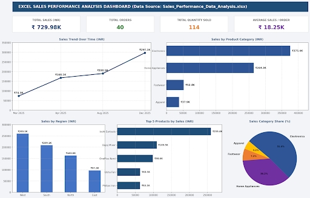

# Sales Performance Analysis - Codec Technologies

## Project Overview
This project presents a comprehensive financial and operational evaluation of historical sales transaction records compiled for Codec Technologies. The goal is to transform raw corporate transaction logs into structured organizational intelligence.

## Key Metrics
* **Total Sales Revenue:** ₹729.98K
* **Total Orders:** 40
* **Total Units Sold:** 114
* **Average Basket Value:** ₹18.25K

## Interactive Dashboards
Below are the executive interactive interfaces built to analyze regional trends and product performance:

### Power BI Executive Dashboard

### Excel Sales Analysis Dashboard

## Core Insights & Recommendations
1. **Product Optimization:** Electronics and Home Appliances together accounts for **87.6%** of gross enterprise revenue. Supply chain capital allocations should heavily favor high-margin electronics inventory scaling.
2. **Regional Targets:** The West Territory is the premier consumer group (₹260.07K). Digital marketing strategies should target the East region to bridge its current revenue gap.
3. **Seasonal Supply:** Demand peaks heavily in Q4 due to holiday procurement. Supply build-ups must execute at least 60 days prior to Q4 cycles to prevent logistical bottlenecks.
   
